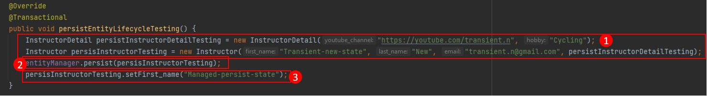
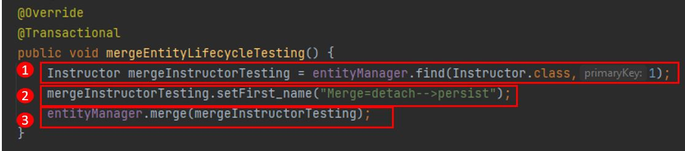

# basic-hibernate
The objective of this project was to learn the basic entity lifecycle in Hibernate. In fact, Hibernate's EntityManager interface provides various methods for performing CRUD (Create, Read, Update, Delete). However, in this example, we will pick up persist, merge, refresh, detach, and remove to demonstrate.

## JPA’s entity lifecycle states
Before we deep dive into the way to use the operations provided by Hibernate and some code demonstrations, I would like to suggest understanding JPA’s entity lifecycle states from the picture and source below.

https://thorben-janssen.com/entity-lifecycle-model/

https://vladmihalcea.com/a-beginners-guide-to-jpa-hibernate-entity-state-transitions/

## Example of Hibernate's operations
As mentioned above, on this project, we will focus on four operations as shown in the picture below with descriptions.

|Operations                     |Description                  |
|-------------------------------|-----------------------------|
|`entityManager.persist`        |Convert an entity object to persist state and will save into database when commit/flush. (Create)|
|`entityManager.merge`          |Updates the state of a detached entity and synchronizes it with the database.|
|`entityManager.refresh`        |Refreshes the state of an entity from the database.|
|`entityManager.detach`			    |Detaches an entity from the persistence context, making it detached.|
|`entityManager.remove`			    |Deletes an entity from the database.|

## Persist Operation
The persist operation in Hibernate is typically used for creating new records in the database. 
To better understand how to use them, please take a look at the illustrator below.

> **1:** We call this step "**Transient/New**" This is just a normal step where we create a new object and instantiate the values Instructor and InstructorDetail. On this step, there is no relationship with the database at all.

> **2:** On this step, we called it "**Managed/Persist**". To call entityManager. persist doesn't mean saving objects into a database.
On the other hand, "persist" means that they're going to track any change on Instructor and InstructorDetail objects.
So when will they save the object into a database ? The answer is when there is a call to "**commit/flush**".

> **3:** After we called persist. Right now we are in the "**Persist state**". On this step, we have edited instructor first_name again. So It's going to track that the first name has changed and wait until you call "**commit/flush**" to record the object in the database.

> **Note:** You may wonder why we didn't see any commit or flush operations in the illustrator. How is it possible to save objects into a database? The answer is "**@Transaction annotation represents commit and flush operations,**" and it's going to conduct after already doing all commands in our method.

> **Therefore,** as a result of everything done in this method, we query a record. It's going to show the first_name = "**Managed-persist-state**".

## Merge Operation
The merge operation in Hibernate is typically used for update the records in the database. 
To better understand how to use them, please take a look at the illustrator below.

> **1:** We retrieve the instructor entity from the database with the condition PimaryKey = 1. And if you get back to taking a look at lifecycle states, you will find the state should be "**Managed/Persist**".

> **2:** On this step, we changed the message of attribute First_name to "Merge=detached-->persist". So they're going to track the change in this attribute.

> **3:** We called "**entityManager.merge**", the entity will still be in the "**Managed/Persist**" state within the persistence context. The changes made to the entity will be tracked by the context, and when a transaction is "**commit/flush**" (@Transaction),the changes will be synchronized and persisted to the database.

## Refresh Operation
The Refresh operation in Hibernate is typically used for refreshing the state of an object from the database. 
To better understand how to use them, please take a look at the illustrator below.

> **1:** We retrieve the instructor entity from the database with the condition PimaryKey = 1. And the detial of the instructor objected to the following:

|Attribute           |Value           |
|----------------|--------------------|
|ID               |1|
|EMAIL            |SOMSAK.Sgmail.com	|
|`FIRST_NAME`     |`SOMSAK`|
|LAST_NAME		    |SANDEE|

> **2:** We changed the message inside attribute FIRST_NAME from "**SOMSAK**" to "**NATHAN**" So they're going to track the change in this attribute. However, It does not commit or do anything with the database.

> **3:** We getFirst_name() for viewing the message inside the atrribute,  and the output prints out "**NATHAN**".

> **4:** We called "**entityManager.refresh**", the entity's going to sync/reload object from the database.

> **5:** We getFirst_name() again for checking the message inside the attribute, and the output prints out "**SOMSAK**".

## Detach Operation
